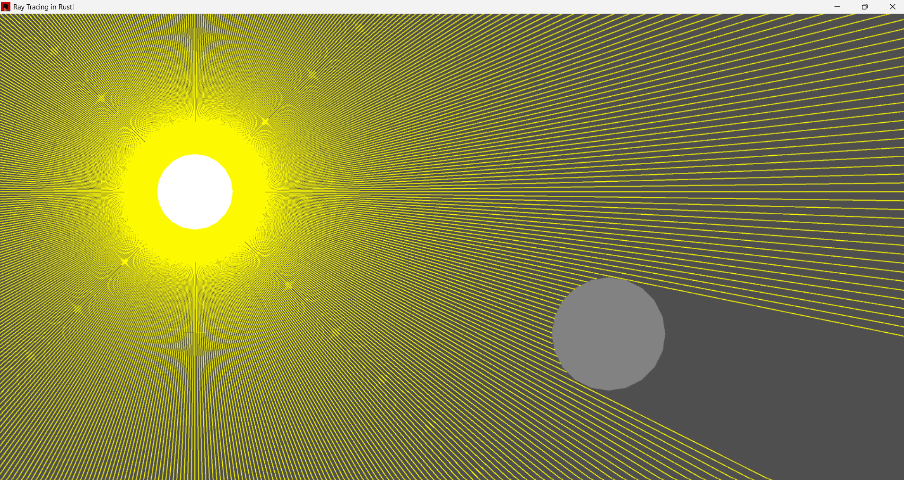

# 2D Ray Tracing & Dynamic Shadows in Rust

An interactive, real-time 2D ray casting and volumetric lighting simulation built from scratch in Rust using the **Macroquad** game library.



## 💡 Purpose of the Project

This project was built as a hands-on learning experiment to master the fundamentals of the **Rust programming language**. 

While the core mechanics might look straightforward, the entire system was designed from the ground up to understand how Rust handles state management, memory safety without a garbage collector, and math-heavy rendering algorithms. It represents a transition from high-level, abstract thinking to performant, low-level architectural software engineering.

## 🚀 Features

- **Real-Time Ray Casting:** Dispatches multiple rays (`120+`) in a 360-degree radius from a central light source.
- **Dynamic Volumetric Shadows:** Utilizes a custom Raymarching/Step-based collision algorithm to detect sphere obstacles and project accurate shadows in real time.
- **Interactive Sandbox:** Both the light source (the "Sun") and the obstacle can be hovered, selected, and dragged anywhere on the screen using the mouse.
- **Collision Boundaries:** Automatic mouse-collision detection based on algebraic circle-radius distances.

## 🛠️ Technical Details: The Raymarching Algorithm

Instead of relying on rigid grid-based matrix algorithms (like DDA), this project implements a clean **Raymarching/Sphere-Tracing-inspired routine** inside the ray casting loop. 

Each ray increments its position forward step-by-step along its vector angle. At every iteration, it computes the distance to the obstacle:
$$\text{distance} = \sqrt{(x_{\text{ray}} - x_{\text{obj}})^2 + (y_{\text{ray}} - y_{\text{obj}})^2}$$

If the distance is less than or equal to the obstacle's radius, the ray breaks immediately, creating a physically accurate shadow cone behind the sphere.

## 🏃 How to Run

1. Make sure you have the [Rust toolchain installed](https://www.rust-lang.org/tools/install).
2. Clone this repository:
   ```bash
   git clone [https://github.com/PedroFranca404/simple-raytracing-rust.git](https://github.com/PedroFranca404/simple-raytracing-rust)
   cd YOUR_REPOSITORY_NAME
